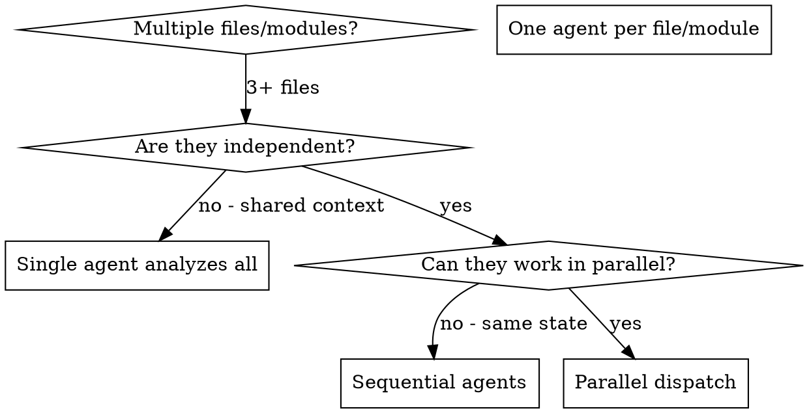

# Dispatching Parallel Extractors

## Overview

When extracting from multiple independent files or modules, processing them sequentially wastes time. Each file analysis is independent and can happen in parallel.

**Core principle:** Dispatch one extractor subagent per independent file or module. Let them work concurrently.

**Announce at start:** "I'm using the dispatching-parallel-extractors skill to analyze these files in parallel."

## When to Use



**Use when:**
- 3+ files with no shared state
- Independent modules can be analyzed separately
- Each file has 5+ patterns (worth a dedicated agent)
- Same artifact type across all files

**Don't use when:**
- Files share business context (same rules flow across files)
- Need to understand cross-file relationships
- Small number of patterns (< 5 per file)
- Mixed artifact types (use orchestrating-extractions instead)

## The Pattern

### 1. Identify Independent Extraction Units

Group files by what's independent:

**By Module:**
- Auth module files (login.ts, register.ts, middleware.ts)
- Payment module files (process.ts, validate.ts, refund.ts)

**By File:**
- Large files with 10+ patterns each
- Each file gets own subagent

**By Pattern Group:**
- Single large file split by pattern groups
- Lines 1-100, 101-200, etc.

### 2. Create Focused Subagent Tasks

Each subagent gets:
- **Specific files:** Exact file paths to analyze
- **Artifact type:** business-rules, process-flows, etc.
- **Output format:** How to structure results
- **Clear scope:** What to extract, what to skip

### 3. Dispatch in Parallel

```typescript
// Example parallel dispatch
Task("Extract business rules from auth module")
Task("Extract business rules from payment module")
Task("Extract business rules from user module")
// All three run concurrently
```

### 4. Review and Aggregate

When subagents return:
1. **Run spec compliance review** on each output
2. **Run quality review** on each output
3. **Check for conflicts** (rare for read-only extraction)
4. **Aggregate outputs** into single file

## Subagent Prompt Structure

Good subagent prompts are:
1. **Focused** - Specific files, specific artifact type
2. **Self-contained** - All context included
3. **Specific about output** - What format, where to save

```markdown
Extract business rules from auth module:

**Files:**
- src/auth/login.ts
- src/auth/register.ts
- src/auth/middleware.ts

**Artifact Type:** business-rules

**Your Process:**
1. Read each file
2. Extract conditional logic, validation, exception handling
3. Format as table with Rule | Source | Enforcement
4. Save to docs/output/business-rules-auth.md

**Return:**
- Rules extracted: [count]
- Files analyzed: [list]
- Output location: [path]
```

## Common Mistakes

**❌ Too broad:** "Extract all business rules" - subagent doesn't know where
**✅ Specific:** "Extract business rules from auth module (3 files)" - focused scope

**❌ No format:** "Extract and save somewhere" - unclear output
**✅ Specific:** "Format as table, save to docs/output/business-rules-auth.md" - clear output

**❌ Sequential execution:** "Do file 1, then file 2, then file 3" - wastes time
**✅ Parallel:** "All three files are independent, analyze concurrently" - efficient

## When NOT to Use

**Shared context:** Files reference each other's rules - analyze together
**Cross-file flows:** Process flows span multiple files - trace together
**Small patterns:** < 5 patterns per file - single agent is faster
**Mixed artifact types:** Different types per file - use orchestrating-extractions

## Real Example

**Scenario:** Extract business rules from 15 files across 3 modules

**Files:**
- Auth: login.ts, register.ts, middleware.ts (5 files)
- Payment: process.ts, validate.ts, refund.ts (4 files)
- User: profile.ts, settings.ts, permissions.ts (6 files)

**Decision:** Independent modules - auth rules separate from payment separate from user

**Dispatch:**
```
Agent 1 → Extract business rules from auth module (5 files)
Agent 2 → Extract business rules from payment module (4 files)
Agent 3 → Extract business rules from user module (6 files)
```

**Results:**
- Agent 1: 20 rules extracted, saved to business-rules-auth.md
- Agent 2: 25 rules extracted, saved to business-rules-payment.md
- Agent 3: 30 rules extracted, saved to business-rules-user.md

**Integration:**
- Spec compliance review: All three pass
- Quality review: All three pass
- Aggregation: Merge into docs/output/business-rules.md

**Time saved:** 3 modules analyzed in parallel vs sequentially

## Key Benefits

1. **Parallelization** - Multiple extractions happen simultaneously
2. **Focus** - Each subagent has narrow scope, less context pollution
3. **Independence** - Subagents don't interfere with each other
4. **Speed** - 3+ files analyzed in time of 1

## Verification

After subagents return:
1. **Review each output** - Verify completeness and accuracy
2. **Check for overlaps** - Any patterns extracted multiple times?
3. **Run quality reviews** - Spec compliance then quality
4. **Aggregate** - Merge outputs into single file
5. **Spot check** - Verify key patterns against source code

## Real-World Impact

From analysis session (2025-03-19):
- 15 files across 3 modules
- 3 agents dispatched in parallel
- All extractions completed concurrently
- Zero conflicts between agents
- 75 rules total extracted in ~10 minutes (vs ~30 sequential)
