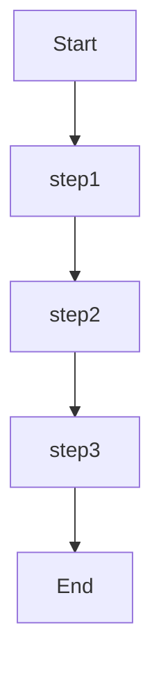
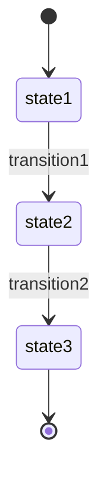
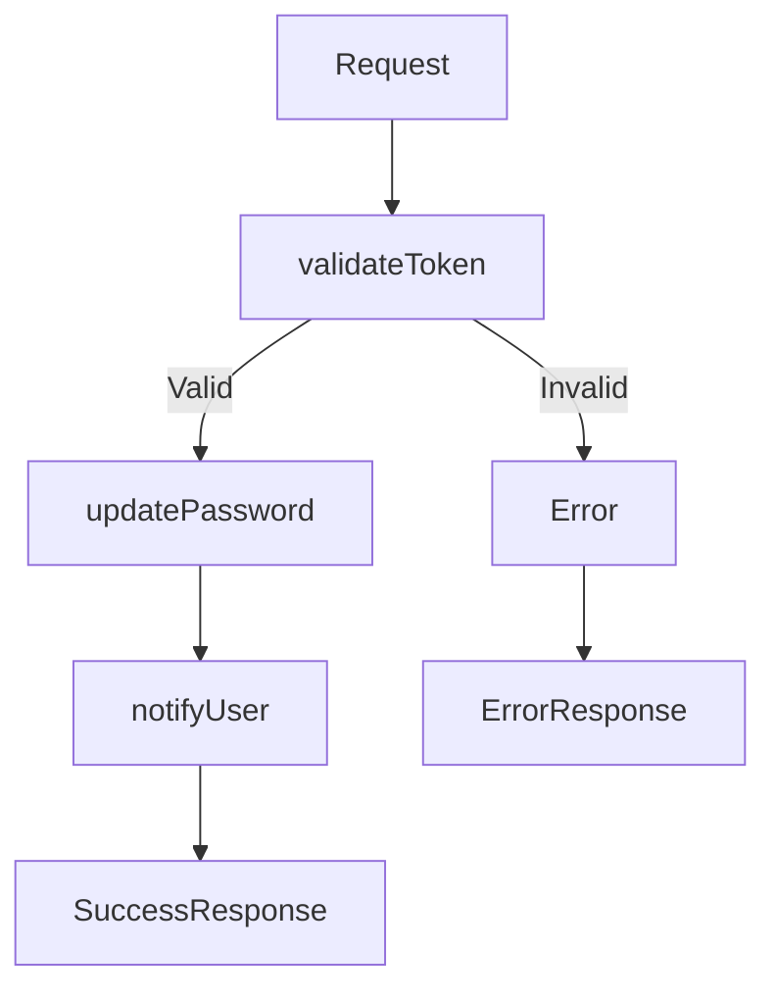
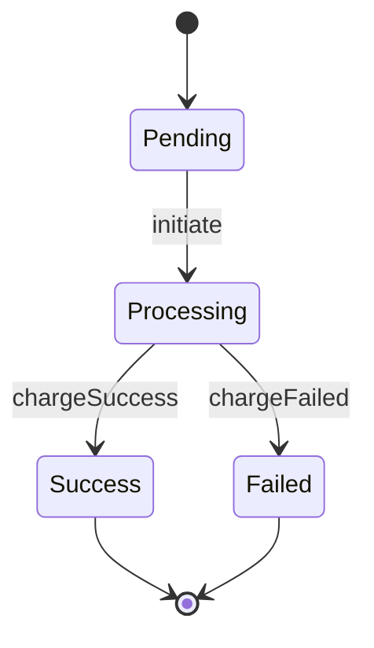

# Process Flows Extraction

Domain knowledge for extracting process flows from code.

## What to Extract

Process flows show how data and control move through the system:

- **Function call chains** - Especially with await, sequential calls
- **State machine implementations** - State transitions, state changes
- **Workflow orchestrators** - Step-by-step processes
- **Async/await sequences** - Promise chains, async flows
- **Event-driven flows** - Event handlers, subscribers, listeners

## Hotspot Discovery

```bash
# Find function call chains
grep -r "await.*\." --include="*.ts" --include="*.js" -l | head -20

# Find state machines
grep -r "state\|transition\|StateMachine" --include="*.ts" -l | head -20

# Find workflow definitions
grep -r "workflow\|orchestrat\|step\|pipeline" --include="*.ts" -l | head -20

# Find promise chains
grep -r "\.then(" --include="*.ts" --include="*.js" -l | head -20
```

## Pattern Signals

| Code Pattern | Process Flow | Mermaid Example |
|--------------|--------------|-----------------|
| `await validateUser(); await createUser();` | Registration: validateUser() → createUser() | `validateUser --> createUser` |
| `transitionTo('processing')` | State transition: pending → processing | `Pending --> Processing` |
| `step1(); step2(); step3();` | Sequential workflow: step1 → step2 → step3 | `step1 --> step2 --> step3` |
| `fetch().then().then()` | Async pipeline: fetch → then → then | `fetch --> then1 --> then2` |
| `on('click', handleClick)` | Event-driven flow: click → handleClick | `click --> handleClick` |
| `states: ['pending', 'processing', 'done']` | State machine with 3 states | `[*] --> pending --> processing --> done --> [*]` |

## Output Format

**Per-module extractor output:**
```markdown
# [Module Name] Module

Extraction: [YYYY-MM-DD]
Files Analyzed: [N] files

## Artifacts

### Flow: [Descriptive Name]
**Source:** [filename.ts:15-30](path/to/filename.ts#L15-L30)



**Description:** [Brief explanation of the flow]

### State Machine: [Name]
**Source:** [filename.ts:10-50](path/to/filename.ts#L10-L50)



**States:** `[state1]` → `[state2]` → `[state3]`
```

Each module file is standalone. The orchestrator creates an 00-INDEX.md that links to all module files.
flowchart TD
    A[Request] --> B[validateUser]
    B --> C[createUser]
    C --> D[sendEmail]
    D --> E[Response]
```

**Description:** New user registration flow with validation and email notification

### Flow: Password Reset
**Source:** [src/auth/password.ts:40-65](src/auth/password.ts#L40-L65)



**Description:** Password reset with token validation

## payment Module

### State Machine: Payment Processing
**Source:** [src/payment/processor.ts:10-50](src/payment/processor.ts#L10-L50)



**States:** `Pending` → `Processing` → (`Success` | `Failed`)
```

---

## Mermaid Diagram Types

Use the appropriate Mermaid diagram for each flow type:

| Flow Type | Mermaid Type | Syntax |
|-----------|--------------|--------|
| **Sequential workflow** | `flowchart TD` | `A --> B --> C` |
| **Conditional flow** | `flowchart TD` | `A -->|Yes| B` and `A -->|No| C` |
| **State machine** | `stateDiagram-v2` | `state1 --> state2: event` |
| **Async sequence** | `flowchart LR` | `A --> B --> C` (left-to-right) |
| **Event-driven** | `flowchart TD` | `Event --> Handler` |
| **Parallel steps** | `flowchart TD` | `A --> B` & `A --> C` |

## Core Principles

**Trace-first:** Follow the execution path from entry point to completion

**One level deep:** Trace at least one function call deep

**Include errors:** Don't skip error/exception paths

**Source locations:** Include file:line-range for each flow step

**Mermaid best practices:**
- Use descriptive node/step names (not just "A", "B", "C")
- Include labels on conditional branches (`|Yes|`, `No`)
- Use `flowchart TD` for top-down flows, `flowchart LR` for left-to-right
- Use `stateDiagram-v2` for state machines (shows states and transitions clearly)
- Keep diagrams focused on one flow per diagram (split complex flows)

## Diagram Creation Guidelines

### When to use each Mermaid type:

**flowchart TD (Top-Down)** - Most common
- Sequential workflows
- Conditional flows with branches
- Event-driven flows
- Any flow with a clear top-to-bottom progression

**flowchart LR (Left-to-Right)**
- Time-sequenced events
- Pipeline stages
- When horizontal layout is more natural

**stateDiagram-v2 (State Diagram)**
- State machines with explicit states
- State transitions with events
- When showing lifecycle states rather than execution steps

### Diagram naming conventions:
- Flows: `Flow: [Descriptive Name]` (e.g., "Flow: User Registration")
- State Machines: `State Machine: [Name]` (e.g., "State Machine: Payment Processing")
- Nodes: Use function/step names or descriptive labels (e.g., `validateUser` not just `B`)
- Edges: Use event names for state transitions (e.g., `transition1`, `chargeSuccess`)
